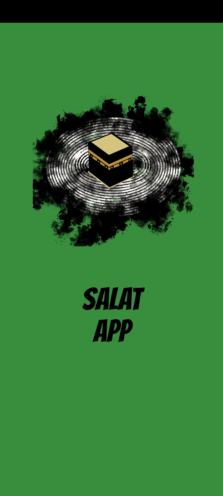
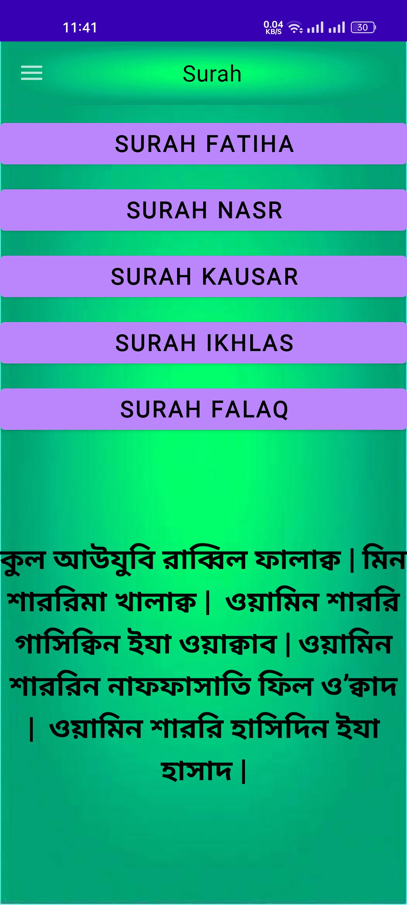

# SALAT_Android_Studio_JAVA
The Salat app shows the timetable of the salat based on their location and also shows the forbidden times of prayers. It also navigates the Qibla location. The next feature of this app is Surah, Hadith. It also shows the nearest Mosques. There is also an Arabic Calendar. In this app, I used APIs for fetching the time of prayers and getting the calendar dates from an Arabic calendar 

For any Query: Mainulislamfahim16@gmail.com
